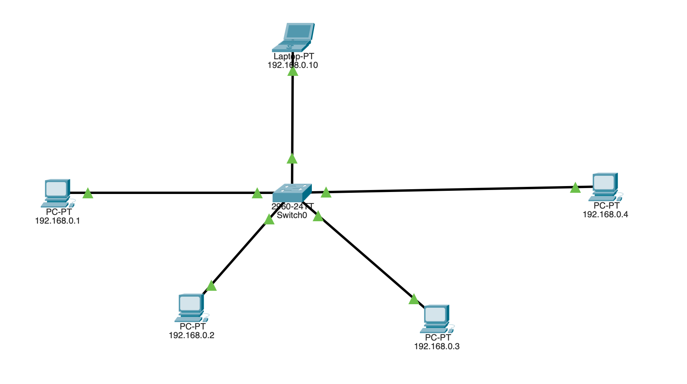

<h1 align="center">
Cisco-Packet-Tracer 
</h1>

This repository contains various network models and designs that I created or assigned to learn Cisco Packet Tracer. This is also a part of my Computer Network Course.

<br/>
<br/>

## 01. Connecting 2 PCs with a Cross FastEthernet Cable

<div align="center">
 </br>

 
 </br>
 </br>

 </br>

</div>
</br>
</br>

## 02. Multiple End Devices are Connected with 1 Switch

<div align="center">
 </br>

 
 </br>
 </br>

 </br>
 
</div>
</br>
</br>

## 03. Behaviour Analysis of Hub and Switch

<div align="center">
 </br>

 
 </br>
 </br>

 </br>
 
</div>

## 04. Setup a DHCP Server (Automatic IP Assigning to multiple end devices)

<div align="center">
 </br>

 
 </br>
 </br>

 </br>
 
</div>

## 05. Setup a DHCP Server with 3 Switches

<div align="center">
 </br>

 
 </br>
 </br>

 </br>
 
</div>
</br>

## 06. Setup a VLAN (Virtual LAN)

<div align="center">
 </br>

 
 </br>
 </br>

 </br>
 
</div>

### CLI Commands to setup VLAN on Switch

</br>

To add a device (connected with FastEthernet Port 0/1) to VLAN 101, simply write :

```
enable
configure terminal

interface fastEthernet 0/1

switch port mode access
switchport access vlan 101

no shutdown
exit

```

To add another device (connected with FastEthernet Port 0/4) to VLAN 101, simply write :

```
interface fastEthernet 0/4

switch port mode access
switchport access vlan 101

no shutdown
exit

```

After separting devices to different VLANs, save data permanently to non-volatile memory with this command:

```
do write memory
```

</br>
</br>

## 07. Setup a Truncated VLAN between 2 Switches

<div align="center">
 </br>

 
 </br>
 </br>

 </br>
 
</div>

### CLI Commands to truncate VLAN on Switch

</br>

Suppose, 2 Switches are connected together with each of its FastEthernet 0/24 Port, Then we will write the following command on both of the switches :

```
enable
configure terminal

interface fastEthernet 0/24

switch port mode trunk


no shutdown
exit

do write memory
```

</br>
</br>

## 08. Send Packets between 2 Different Network with a Router

<div align="center">
 </br>

 
 </br>
 </br>

 </br>
 
</div>

To setup a router's port (suppose gigabitEthernet 0/1) with an ip address 192.168.5.1, we will write:

```
enable
configure terminal

interface gigabitEthernet 0/1

ip address 192.168.5.1 255.255.255.0

no shutdown
exit

do write memory
```

</br>
</br>

## 09. Send Packets between 2 Different Network with 3 Router and Static Routing

<div align="center">
 </br>

 
 </br>
 </br>

 </br>
 
</div>

- To setup a router's port (suppose gigabitEthernet 0/1) with an ip address 192.168.5.1, we will write:

```
enable
configure terminal

interface gigabitEthernet 0/1

ip address 192.168.5.1 255.255.255.0

no shutdown
exit

do write memory
```

- To forward an ip address of a network (192.168.5.0) to neighbour's router (192.168.60.7), we will write:

```
enable
configure terminal

ip route 192.168.5.0 255.255.255.0 192.168.60.7

no shutdown
exit

do write memory
```

</br>
</br>

## 10. Inter VLAN Routing

- VLAN1 and VLAN2 are created using CLI.
- Usually, we know, same VLAN can communicate together
- But here, VLAN1 can also send a message to VLAN2 by using the router.
- For setting up default gateways, never forget to add them also into the same VLAN.
<div align="center">
 </br>

 
 </br>
 </br>

 </br>
 
</div>

## 11. Alternative Solution for Inter VLAN Routing (without VLAN)

- All PCs are set to default VLAN(1)
- Usually, we know, switch can only communicate with the devices with same IP series.
- As the IP series of VLAN 1 and VLAN 2 devices are different, so using this concept, switch will only pass messages to same IP devices.
- But here, there is an one major fault. Changing the device IP will change their VLAN which is unsafe for a network.
  </br>

<div align="center">
 </br>

 
 </br>
 </br>

 </br>
 
</div>

© Humayra Khanom

